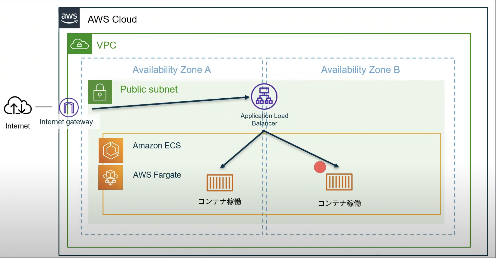

# CDKでECS on Fargate構築

まずは以下のような構成で構築することを目標とする
ここで簡単にCDKの構築手順やデプロイ手順を掴みたい。



## 手順

### 1. DockerfileをECRにpush

<details><summary>手順</summary>

1. ECRに対してDockerクライアントを認証

```sh
aws ecr get-login-password --region <region> | docker login --username AWS --password-stdin <accountId>.dkr.ecr.<region>.amazonaws.com
```

2. ECRリポジトリ作成

```sh
aws ecr create-repository \
    --repository-name sample-node-app \
    --image-scanning-configuration scanOnPush=true \
    --region <region>
```

3. Dockerビルド

```sh
docker build -t sample-node-app .
```

4. イメージにECR用のタグをつける

```sh
docker tag sample-node-app:latest <accountId>.dkr.ecr.<region>.amazonaws.com/sample-node-app:latest
```

5. イメージをpush

```sh
docker push <accountId>.dkr.ecr.<region>.amazonaws.com/sample-node-app:latest
```

</details>

### 2. CDKでECS on Fargate構築

`lib`ディレクトリ配下に構築

### 3. デプロイ
